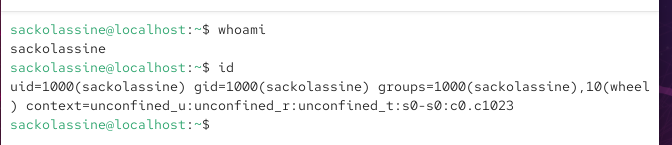
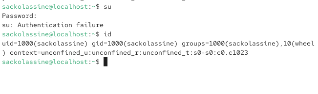
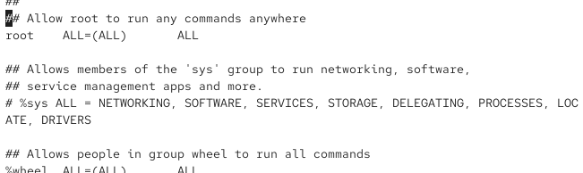
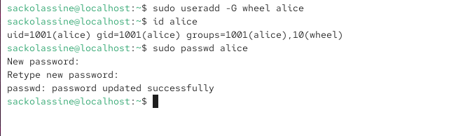
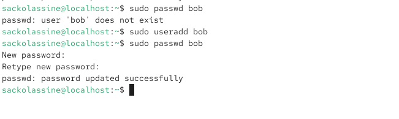
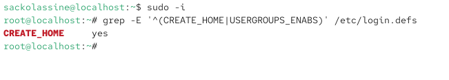
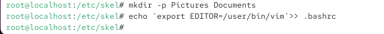
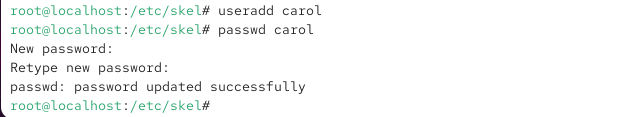
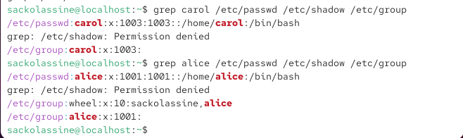
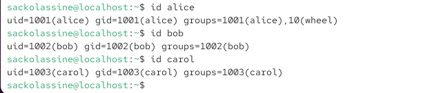

# Лабораторная работа №2. Управление пользователями и группами
## 1. Цель работы

Изучить принципы управления пользователями и группами в операционной системе Linux, научиться переключаться между учетными записями, создавать и изменять пользователей, управлять группами и параметрами паролей.
## 2. Задание

В ходе лабораторной работы необходимо:

- ознакомиться со справочной информацией команд `ls`, `whoami`, `id`, `groups`, `su`, `sudo`, `passwd`, `vi`, `visudo`, `useradd`, `usermod`, `userdel`, `groupadd`, `groupdel`;
- выполнить переключение между учетными записями;
- создать и настроить пользователей;
- изучить системные файлы `/etc/passwd`, `/etc/shadow` и `/etc/group`;
- создать группы и добавить пользователей в дополнительные группы;
- проверить корректность выполненных настроек.
## 3. Выполнение работы
### 3.1. Определение текущего пользователя


Были выполнены команды:

```bash
whoami
id
Команды позволяют определить имя текущего пользователя, его UID, основной GID и группы.

3.2. Переключение на пользователя root

Для переключения на учетную запись администратора была использована команда:

su
id

После проверки была выполнена команда exit для возврата к предыдущей учетной записи.

3.3. Проверка конфигурации sudo

Для безопасного просмотра конфигурации sudo использовалась команда:

sudo -i visudo

Была проверена конфигурация группы wheel.

3.4. Создание пользователя alice

Пользователь alice был создан с включением в группу wheel:

sudo useradd -G wheel alice
id alice
sudo passwd alice

После создания была выполнена проверка идентификатора и групп пользователя.

3.5. Создание пользователя bob

Пользователь bob был создан с помощью:

sudo useradd bob
sudo passwd bob
id bob

3.6. Настройка параметров создания пользователей

Были проверены параметры файла /etc/login.defs, определяющие поведение при создании учетных записей.

Основные параметры:

CREATE_HOME
USERGROUPS_ENAB

3.7. Настройка каталога /etc/skel

В каталоге /etc/skel были подготовлены стандартные элементы, которые используются при создании домашних каталогов пользователей.

Были созданы каталоги:

Pictures
Documents

Также была настроена переменная окружения:

export EDITOR=/usr/bin/vim

3.8. Создание пользователя carol

Был создан пользователь carol, после чего выполнен переход в его учетную запись и проверены идентификатор, домашний каталог и его содержимое.

Использовались команды:

useradd carol
passwd carol
su carol
id
cd
ls -Al

3.9. Проверка информации о пароле пользователя carol

Информация об учетной записи была проверена в /etc/shadow:

sudo cat /etc/shadow | grep carol

3.10. Настройка срока действия пароля

Для пользователя carol были установлены параметры срока действия пароля:

sudo passwd -n 30 -w 3 -x 90 carol

После изменения параметры были повторно проверены в /etc/shadow.

3.11. Проверка системных файлов пользователей

Была проверена информация о пользователях в трех основных системных файлах:

/etc/passwd
/etc/shadow
/etc/group

Проверка выполнялась командами:

grep alice /etc/passwd /etc/shadow /etc/group
grep carol /etc/passwd /etc/shadow /etc/group

3.12. Создание групп и проверка членства

Были созданы группы:

sudo groupadd main
sudo groupadd third

Пользователи были добавлены в дополнительные группы:

sudo usermod -aG main alice
sudo usermod -aG main bob
sudo usermod -aG third carol

После этого было проверено членство пользователей в группах:

id alice
id bob
id carol
getent group main
getent group third

4. Контрольные вопросы
1. При помощи каких команд можно получить информацию о UID пользователя и его группах?

Для получения информации используются команды:

id
id username
groups
id -nG

Команда id показывает UID, основной GID и группы пользователя.

2. Какой UID имеет пользователь root?

Пользователь root имеет UID 0.

Узнать UID можно командой:

id root
3. В чем различие между su и sudo?

su используется для переключения на другую учетную запись пользователя.

sudo позволяет выполнить отдельную команду с правами другого пользователя, обычно root, без полного переключения учетной записи.

4. В каком конфигурационном файле определяются параметры sudo?

Основной конфигурационный файл sudo:

/etc/sudoers
5. Какую команду следует использовать для безопасного изменения конфигурации sudo?

Используется:

visudo

Она предназначена для безопасного редактирования конфигурации sudo и проверки синтаксиса.

6. Членом какой группы должен быть пользователь для получения административных прав через sudo?

В данной конфигурации Linux используется группа:

wheel

Членство можно проверить командой:

id username
7. Какие файлы и каталоги определяют параметры новых учетных записей?

Основными источниками являются:

/etc/login.defs
/etc/default/useradd
/etc/skel

Например, /etc/login.defs содержит параметры создания учетных записей и политики паролей, а /etc/skel содержит стандартное содержимое домашнего каталога нового пользователя.

8. Где хранится информация о первичной и дополнительных группах?

Информация о пользователе и его основной группе содержится в:

/etc/passwd

Дополнительные группы определяются в:

/etc/group

Информацию о группах пользователя alice можно проверить:

id alice
groups alice
9. Какие команды используются для изменения информации о пароле?

Основная команда:

passwd

Для управления сроками действия пароля могут использоваться параметры:

passwd -n 30 -w 3 -x 90 username

где задаются минимальный срок, срок предупреждения и максимальный срок действия пароля.

10. Какую команду использовать для прямого изменения /etc/group?

Для прямого редактирования файла /etc/group используется:

vigr

Использование vigr предпочтительнее обычного текстового редактора, поскольку команда предназначена для безопасного редактирования системного файла групп.

5. Вывод

В ходе лабораторной работы были изучены основные механизмы управления пользователями и группами Linux.

Были выполнены операции переключения учетных записей, создания пользователей alice, bob и carol, настройки параметров учетных записей и паролей, проверки системных файлов /etc/passwd, /etc/shadow, /etc/group, а также создания и назначения дополнительных групп.

Полученные результаты подтверждены скриншотами выполнения команд.




*Рисунок 1. Проверка текущего пользователя и идентификатора.*



*Рисунок 2. Переход к учетной записи root.*



*Рисунок 3. Проверка настройки sudo и группы wheel.*



*Рисунок 4. Создание пользователя alice.*



*Рисунок 5. Создание пользователя bob.*



*Рисунок 6. Настройка параметров учетных записей.*



*Рисунок 7. Настройка каталога /etc/skel.*



*Рисунок 8. Создание пользователя carol.*


*Рисунок 9. Проверка записи пользователя carol в /etc/shadow.*


*Рисунок 10. Настройка срока действия пароля.*



*Рисунок 11. Проверка домашнего каталога.*



*Рисунок 12. Работа с дополнительными группами.*
