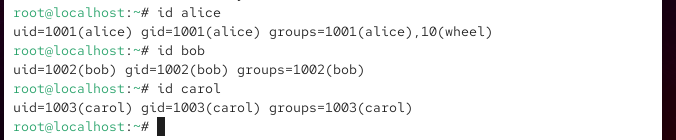
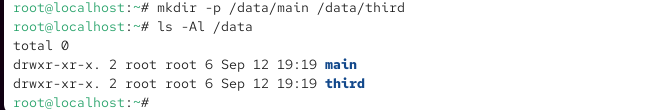
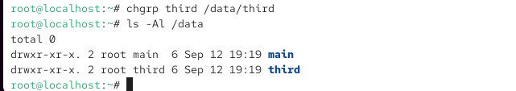
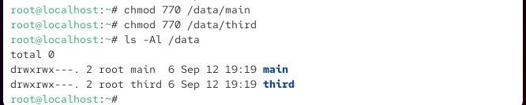
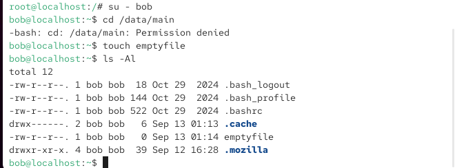
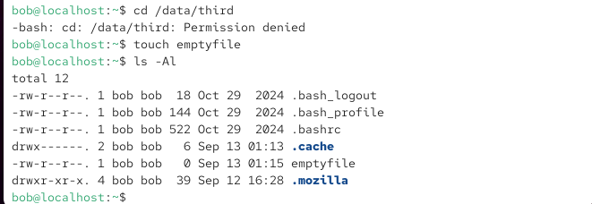
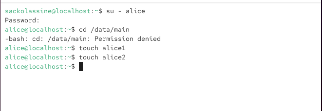
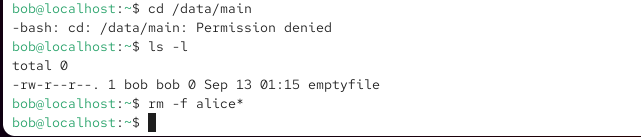
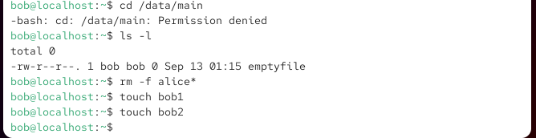

# Лабораторная работа № 3
# Настройка прав доступа

**Студент:** SACKO LASSINÉ

---

## 1. Цель работы

Получение навыков настройки базовых и специальных прав доступа для групп пользователей в операционной системе типа Linux.

## 2. Задание

1. Изучить справочные страницы `man` для команд `chgrp`, `chmod`, `getfacl`, `setfacl`.
2. Выполнить действия по управлению базовыми разрешениями.
3. Выполнить действия по управлению специальными разрешениями.
4. Выполнить действия по управлению расширенными разрешениями с использованием ACL.

---

# 3. Ход выполнения работы

## 3.1. Управление базовыми разрешениями

Были созданы каталоги `/data/main` и `/data/third`.

Для каталога `/data/main` группой-владельцем назначена группа `main`, а для `/data/third` — группа `third`.

После этого для обоих каталогов установлены права `770`. Это означает полный доступ владельцу и группе и отсутствие доступа для остальных пользователей.

### Проверка root



### Создание каталогов



### Смена группы-владельца



### Установка прав 770



### Проверка доступа Bob к /data/main

Пользователь `bob` является членом группы `main`, поэтому он может работать с каталогом `/data/main`.



### Проверка доступа Bob к /data/third

В каталоге `/data/third` пользователь `bob` не имеет необходимых прав.



---

# 3.2. Управление специальными разрешениями

Сначала были созданы файлы `alice1` и `alice2` пользователем `alice`.



До установки sticky bit пользователь `bob`, являющийся членом группы `main`, смог удалить файлы Alice.



Затем Bob создал файлы `bob1` и `bob2`.



Для общего каталога `/data/main` были установлены SGID и sticky bit:

```text
chmod g+s,o+t /data/main

После установки SGID новые файлы Alice наследуют группу-владельца каталога main.

Sticky bit запрещает Alice удалять файлы, принадлежащие Bob.

3.3. Управление расширенными разрешениями ACL

Для группы third были установлены права чтения и выполнения в /data/main.

Для группы main были установлены права чтения и выполнения в /data/third.

Использовались команды:

setfacl -m g:third:rx /data/main
setfacl -m g:main:rx /data/third
ACL каталога /data/main

ACL каталога /data/third

newfile1 в /data/main

newfile1 в /data/third

3.4. ACL по умолчанию

Для каталогов были установлены ACL по умолчанию:

setfacl -m d:g:third:rwx /data/main
setfacl -m d:g:main:rwx /data/third

После создания новых файлов были проверены унаследованные ACL.

newfile2 в /data/main

newfile2 в /data/third

3.5. Проверка прав пользователя carol

Пользователь carol входит в группу third.

Были проверены операции удаления файлов:

rm /data/main/newfile1
rm /data/main/newfile2

Затем была проверена возможность записи:

echo "Hello, world" >> /data/main/newfile1
echo "Hello, world" >> /data/main/newfile2

4. Контрольные вопросы
1. Как следует использовать команду chown, чтобы установить владельца группы для файла?

Для изменения группы-владельца используется:

chown :group file

Например:

chown :main /data/main/file

Можно также одновременно указать пользователя и группу:

chown alice:main file
2. С помощью какой команды можно найти все файлы, принадлежащие конкретному пользователю?

Используется команда find с параметром -user.

Например:

find /data -user alice 2>/dev/null

Команда найдёт файлы и каталоги, владельцем которых является alice.

3. Как применить разрешения на чтение, запись и выполнение для всех файлов в каталоге /data для пользователей и владельцев групп, не устанавливая никаких прав для других?

Можно использовать:

chmod -R 770 /data

В результате владелец и группа получают rwx, а остальные пользователи не получают прав.

4. Какая команда позволяет добавить разрешение на выполнение для файла?

Используется:

chmod +x filename

Например:

chmod +x script.sh
5. Какая команда позволяет убедиться, что групповые разрешения для новых файлов будут присвоены владельцу группы каталога?

Для этого используется SGID:

chmod g+s /data/main

Проверить результат можно:

ls -ld /data/main

Наличие s в правах группы показывает установленный SGID.

6. Как сделать так, чтобы пользователи могли удалять только свои файлы или файлы из каталога, владельцами которого они являются?

Используется sticky bit:

chmod +t /data/main

В лабораторной работе он устанавливается вместе с SGID:

chmod g+s,o+t /data/main
7. Какая команда добавляет ACL с правом чтения для группы для существующих файлов текущего каталога?

Например, для группы third:

setfacl -m g:third:r-- ./*

Для каталогов дополнительно может потребоваться право выполнения для возможности прохода по каталогу.

8. Как гарантировать права чтения группы для существующих файлов, подкаталогов и будущих файлов?

Для существующих объектов можно использовать рекурсивный ACL:

setfacl -R -m g:third:r-- .

Для будущих объектов устанавливается default ACL на каталоги:

find . -type d -exec setfacl -m d:g:third:r-- {} +
9. Какое значение umask нужно установить, чтобы другие пользователи не получали разрешения на новые файлы?

Можно установить:

umask 077

После этого группа и остальные пользователи не получают прав при создании новых файлов и каталогов.

10. Какая команда гарантирует, что никто не сможет случайно удалить файл myfile?

Для защиты файла от удаления и изменения можно использовать атрибут immutable:

chattr +i myfile

Проверить атрибут:

lsattr myfile

Для снятия защиты:

chattr -i myfile
5. Выводы

В ходе лабораторной работы были изучены и практически применены базовые права доступа Linux, изменение группы-владельца с помощью chgrp, установка прав с помощью chmod, специальные разрешения SGID и sticky bit, а также расширенные списки контроля доступа ACL с использованием команд setfacl и getfacl.

Были выполнены проверки доступа пользователей alice, bob и carol. Полученные результаты зафиксированы на скриншотах.

Поставленная цель лабораторной работы достигнута.

6. Основные команды
su
mkdir
ls
chgrp
chmod
touch
rm
setfacl
getfacl
echo
chown
find
umask
chattr

