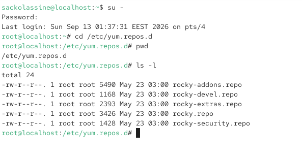
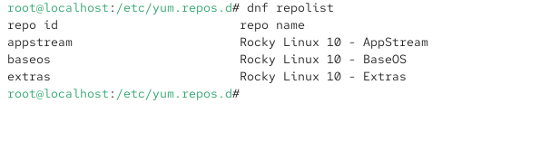
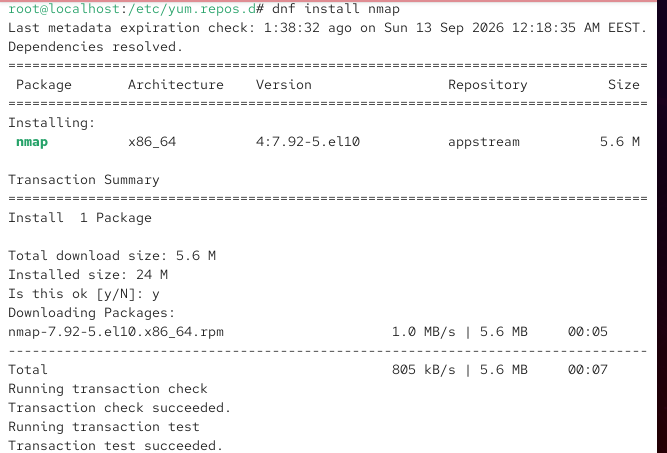
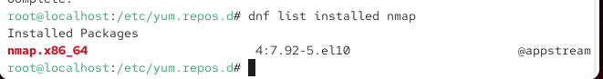
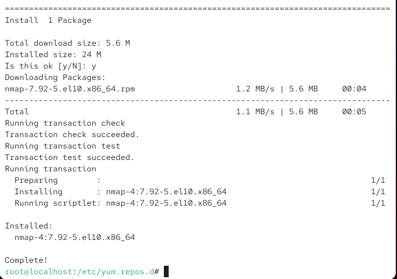
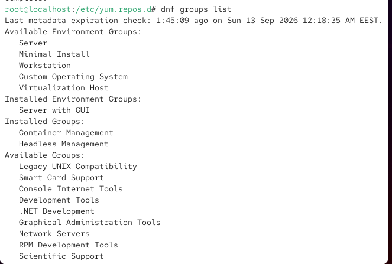
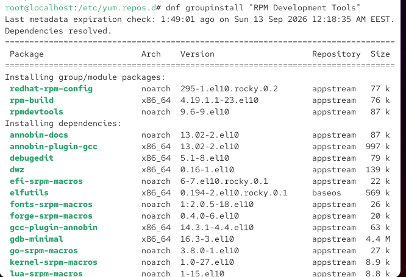
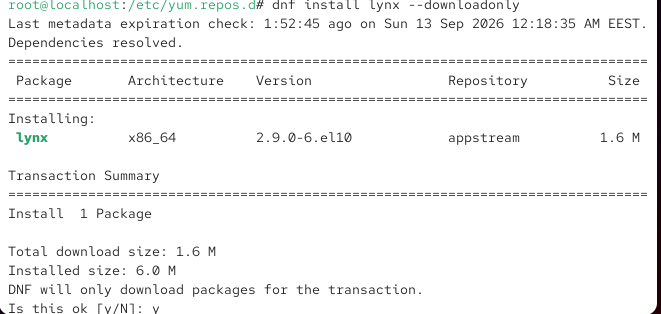
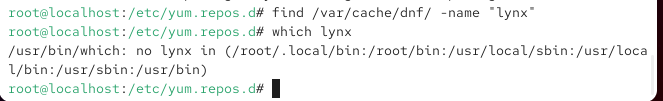
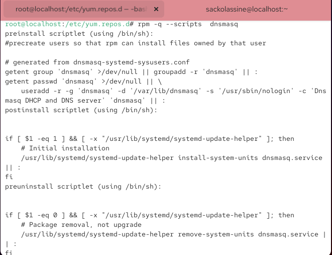

# Лабораторная работа № 4. Работа с программными пакетами

**Студент:** SACKO LASSINÉ

## 1. Цель работы

Получить навыки работы с репозиториями и менеджерами пакетов.

## 2. Задание

Изучить подключение репозиториев и основные возможности DNF: поиск, установка, обновление, удаление пакета и работа с историей действий. Выполнить установку и удаление пакетов с использованием DNF и RPM.

# 3. Ход выполнения работы

## 3.1. Подключённые репозитории

Выполнены следующие команды:

```bash
su -
cd /etc/yum.repos.d
ls
cat название_репозитория.repo
```

Результат выполнения: **Репозитории**.



## 3.2. Список репозиториев

Выполнены следующие команды:

```bash
dnf repolist
```

Результат выполнения: **DNF repolist**.



## 3.3. Поиск user

Выполнены следующие команды:

```bash
dnf search user
```

Результат выполнения: **DNF search user**.



## 3.4. Поиск nmap

Выполнены следующие команды:

```bash
dnf search nmap
dnf info nmap
```

Результат выполнения: **DNF nmap**.



## 3.5. Установка nmap

Выполнены следующие команды:

```bash
dnf install nmap
dnf list installed nmap
dnf remove nmap
```

Результат выполнения: **Установка nmap**.



## 3.6. Шаблон nmap*

Выполнены следующие команды:

```bash
dnf install nmap*
dnf list installed nmap
dnf remove nmap*
```

Результат выполнения: **Шаблон nmap**.



## 3.7. Группы пакетов

Выполнены следующие команды:

```bash
dnf groups list
LANG=C dnf groups list
dnf groups info "RPM Development Tools"
dnf groupinstall "RPM Development Tools"
dnf groupremove "RPM Development Tools"
```

Результат выполнения: **Группы DNF**.



## 3.8. История DNF

Выполнены следующие команды:

```bash
dnf history
```

Результат выполнения: **История DNF**.



## 4.1. Пакет lynx

Выполнены следующие команды:

```bash
dnf list lynx
dnf install lynx --downloadonly
find /var/cache/dnf/ -name lynx*
which lynx
rpm -qf $(which lynx)
rpm -qi lynx
rpm -ql lynx
rpm -qd lynx
man lynx
rpm -qc lynx
rpm -q --scripts lynx
rpm -e lynx
```

Результат выполнения: **Пакет lynx**.



## 4.2. Пакет dnsmasq

Выполнены следующие команды:

```bash
dnf list dnsmasq
dnf install dnsmasq
which dnsmasq
rpm -qf $(which dnsmasq)
rpm -qi dnsmasq
rpm -ql dnsmasq
rpm -qd dnsmasq
man dnsmasq
rpm -qc dnsmasq
rpm -q --scripts dnsmasq
rpm -e dnsmasq
```

Результат выполнения: **Пакет dnsmasq**.



# 4. Контрольные вопросы

## 1. Какая команда позволяет искать пакет RPM, содержащий файл useradd?

```bash
 dnf provides "*bin/useradd"
```

## 2. Какие команды позволяют показать имя группы DNF и её содержимое?

```bash
dnf groups list
 dnf groups info "<имя группы>"
```

## 3. Какая команда позволяет установить RPM, загруженный из Интернета и отсутствующий в репозиториях?

```bash
dnf install http://server/repo/package.rpm
```

## 4. Какая команда показывает скрипты RPM-пакета?

```bash
rpm -q --scripts package
```

## 5. Какая команда показывает всю документацию RPM-пакета?

```bash
rpm -qd package
```

## 6. Какая команда показывает, какому RPM-пакету принадлежит файл?

```bash
rpm -qf /path/to/file
```

# 5. Вывод

Цель лабораторной работы достигнута. Получены практические навыки работы с репозиториями, DNF и RPM.